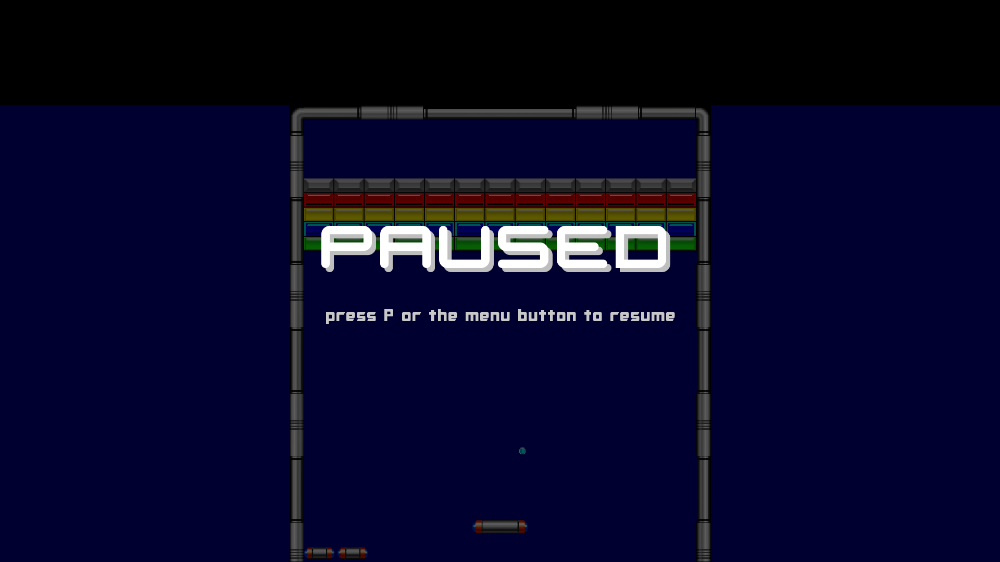

# Arkanoid

[](https://travis-ci.org/wkeeling/arkanoid)

I decided I would have a go at building a game using Python and [pygame](http://www.pygame.org/), and I chose the 1980's arcade classic, Arkanoid.

I've always enjoyed breakout-type games which are addictive and satisfying to play, and Arkanoid with its varying brick layouts, powerups and enemies adds some extra fun and depth to both the gameplay and code design.

Being new to pygame, I started out by reading the tutorials, one of which helpfully uses Pong [as an example](http://www.pygame.org/docs/tut/tom/MakeGames.html). This enabled me to get a headstart with the basic paddle and ball concepts which I was then able to build upon.

This implementation of Arkanoid is still work in progress. The following sequences of the first 4 levels give you an idea of how it looks.

## Changes from upstream [wkeeling/arkanoid](https://github.com/wkeeling/arkanoid)

This fork extends the original four-round game with the following changes.

### Resolution: 1920×1080 (up from 600×800)

The original game was authored for a fixed `600×800` window. Every on-screen offset, font size, gap and surface dimension in the codebase has been expressed against that reference resolution and routed through a new `Layout` class in [`arkanoid/game.py`](arkanoid/game.py) that uniformly scales and centres the play area at runtime. Changing `DISPLAY_SIZE` in that file is now the only thing required to retarget the game at any other resolution.

The default resolution is `1920×1080` (Full HD), so the game runs fullscreen-ish on a typical desktop monitor. 

### Gamepad / joystick support

A new [`arkanoid/gamepad.py`](arkanoid/gamepad.py) module wraps `pygame.joystick` and exposes a small object that the rest of the game can talk to without needing to know about pygame events directly. Standard XInput / DirectInput controllers (Xbox 360, Xbox One, PS3, PS4, generic pads) all work out of the box.

The paddle listens to the left analog stick **and** the D-pad with a configurable deadzone, and a separate `_gamepad_active` flag means the keyboard and the gamepad can be used interchangeably on the same run - whichever input is currently deflected wins, and the other input is preserved in the background rather than being clobbered. The catch (C) and laser powerups both honour the gamepad's A button, so a controller-only player can fire the laser and release caught balls without ever touching the keyboard.

See [Controls](#controls) below for the full button mapping.

### New levels: 6, 7, 8 and 9

Four new rounds have been added on top of the upstream four (and the existing round 5). Round 9 features two symmetric gold clusters at the top and a central rectangular block with pink/orange borders and a green/teal interior.

### New levels: 10–20

Eleven additional rounds (10–20) with layouts taken from the original Arkanoid stages. Each level uses the next enemy type and background in rotation (cone → pyramid → molecule → cube for enemies; hex → circles → rects → chevrons for backgrounds). Silver brick durability now scales with the round number (2 hits for rounds 1–8, +1 every 8 rounds).

### Sound effects

The game includes sound effects loaded from `arkanoid/data/sound/`. Sounds play for brick hits (with a distinct tone for gold and first-hit silver bricks), paddle bounces, enemy explosions, laser fire, powerup collection and round transitions. Rapid re-triggers of the same sound stop the previous instance to avoid overlap.

### Shadow rendering

All sprites (bricks, ball, enemies) cast gradient shadows. Wall shadows fade from the left, right and top edges into the play area, adding depth to the scene.

### Intro music

The start screen plays a looping background music track (`intro.mp3`). The music starts on game launch and stops when the first round begins. It resumes when the player returns to the start screen after a game ends.

### Gold brick timeout

If no destructible brick is hit for 3 minutes of active play (pauses excluded), all gold bricks transform into normal yellow bricks so the level remains completable.

### Gold brick animation

Gold bricks play a diagonal shine animation when hit by the ball, giving visual feedback even though they are indestructible.

### Prologue typewriter text

The start screen displays a story prologue with a typewriter effect, revealing one character every 2 frames.

### Quit confirmation

Pressing **Esc** or **Alt+F4** opens a "Quit game? Y / N" confirmation overlay instead of exiting immediately. Only **Esc** can dismiss the overlay; **Y** quits and **N** resumes.

### Paddle bounce angle

The ball bounce angle off the paddle is continuous and depends on where the ball strikes. The centre 60% sends the ball straight up; the outer 20% on each side produces the maximum deflection (±50°).

### Paddle and ball speed

Paddle speed increased to 12 px/frame. Maximum ball speed capped at 12 px/frame (matching the paddle speed).

### Extra life display

When the player has more than 4 extra lives, a single paddle icon with an "xN" label is shown instead of individual icons, saving screen space.

### Shared decorative backgrounds

A new [`arkanoid/rounds/background.py`](arkanoid/rounds/background.py) module provides four reusable background generators (hexagonal honeycomb, overlapping circles, rounded rectangles, chevrons) that are shared across rounds 1–9, cycling every four levels.

### Round transition effect

When all bricks in a round are destroyed, the play area fades to black, a full-screen starfield with a "Level X" announcement appears, and then the new play area fades in.

### Enemy upward movement

Enemies can now move upward (not just sideways and down) when blocked, preventing them from getting permanently stuck in corners or between the paddle and walls.

### Extra lives on score thresholds

Following the original arcade rules, the player earns an extra life at **20,000** points and then every **60,000** points thereafter (80K, 140K, 200K, ...).

### Pause mode

The game can be paused at any time during a round by pressing **P** on the keyboard or the **Back / View / Select** button (button 6) on the gamepad. While paused, the state machine, sprite updates and animations are all frozen and a translucent overlay with a centred "PAUSED" caption is drawn over the last rendered frame, so the player can see exactly where the action was interrupted. Pressing P or the menu button again resumes play. The keyboard and the gamepad can be used interchangeably - the resume hint on the overlay automatically mentions whichever input device is currently connected.



### Alternative keyboard layout: A / D

In addition to the arrow keys, the paddle can be controlled with **A** (left) and **D** (right) on the keyboard, matching the layout used by many other arcade / breakout-style games. Arrow keys and A / D can be mixed freely (e.g. press A to move left while still holding the right arrow).


## Start


## Round 1


## Round 2


## Round 3


## Round 4


## Installation

Arkanoid runs on Python 3 and requires pygame, plus a few system-wide dependencies.

### On Ubuntu 16.04

Install virtualenv if not already installed:

```
sudo apt install virtualenv
```

Create a virtualenv, with python 3 as the default python version:

```
virtualenv -p /usr/bin/python3 environments/arkanoid
```

Activate the virtualenv:

```
source environments/arkanoid/bin/activate
```

Install the system-wide dependencies for python3-dev:

```
sudo apt install python3-dev
```

Install the system-wide build dependencies for pygame:

```
sudo apt build-dep python-pygame
```

**NOTE:** If the above command generates a message saying **E: You must put some 'source' URIs in your sources.list**, then edit `/etc/apt/sources.list` and uncomment the lines that start `deb-src`. Save the file, then run `sudo apt update`. Now re-run the previous "build-dep" command.

Install other system-wide dependencies:

```
sudo apt install libfreetype6-dev mercurial
```
(mercurial is needed for building pygame from source)

Clone the arkanoid project:

```
git clone https://github.com/wkeeling/arkanoid.git
```

Install the project specific dependencies (will build pygame from source):

```
cd arkanoid; pip install -r requirements.txt
```

Run the game:

```
python arkanoid.py
```

By default the game opens a `1920×1080` window; change `DISPLAY_SIZE` near the top of [`arkanoid/game.py`](arkanoid/game.py) to run at any other resolution. All UI elements scale automatically.

## Controls

### Keyboard

* **Left / Right arrows** or **A / D** - move the paddle
* **Space** - fire the laser (when the laser powerup is active) and release caught balls
* **P** - toggle the in-game pause overlay
* **1-9** - on the start screen, jump straight to the matching round
* **Enter** - start the game from the start screen
* **Esc** - quit

### Gamepad

Any standard XInput / DirectInput controller works (Xbox 360/One, PS3/PS4, generic pads). The wrapper applies a `0.25` deadzone on the left stick so the paddle does not drift when you take your finger off.

* **Left stick / D-pad** - move the paddle
* **A / Cross** (button 0) - fire the laser (when the laser powerup is active) / accept the highlighted level on the start screen / start the game
* **B / Circle** (button 1) - release the ball from the paddle at the start of a round (analog of pressing Space when the ball is on the paddle)
* **Start** (button 7) - start the game (alternative to A on controllers that expose a dedicated Start button)
* **Back / View / Select** (button 6) - toggle the in-game pause overlay (analog of pressing P on the keyboard)

If no controller is connected the gamepad wrapper reports a centred stick and no button presses, so the keyboard is the only input source and the rest of the game does not need to special-case the "no controller" case.

## Credits
* [The Spriters Resource](http://www.spriters-resource.com/) for the majority of the graphics.
* [Positech Games](http://www.positech.co.uk/content/explosion/explosiongenerator.html) for the enemy explosion graphics.
* [Geronimo](http://www.dafont.com/paradox-fontworks.d5233) for the Generation font used in the game.
* [Pixel Sagas](http://www.dafont.com/optimus.font) for the Optimus font used in the game.
* [pygame-text](https://github.com/cosmologicon/pygame-text) for text drawing functions.
* Taito Corporation for the original Arkanoid game.

## Author

Will Keeling (original);
Q2ckerr: gamepad support, resolution scaling, levels 6-20, pause mode, A/D keyboard controls, sound effects, shadows, decorative backgrounds, round transitions, enemy AI improvements, extra lives, intro music, gold brick timeout, typewriter prologue, quit confirmation, paddle bounce rework, speed adjustments and extra life display added in this fork.

Last updated: 2026-06-18
